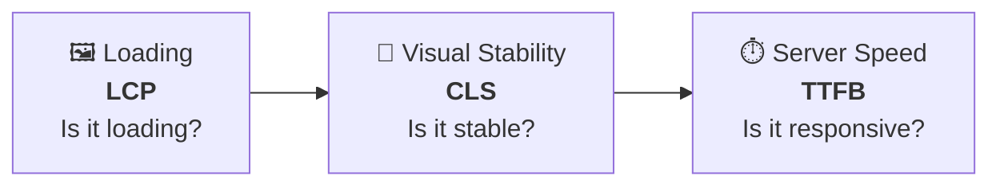
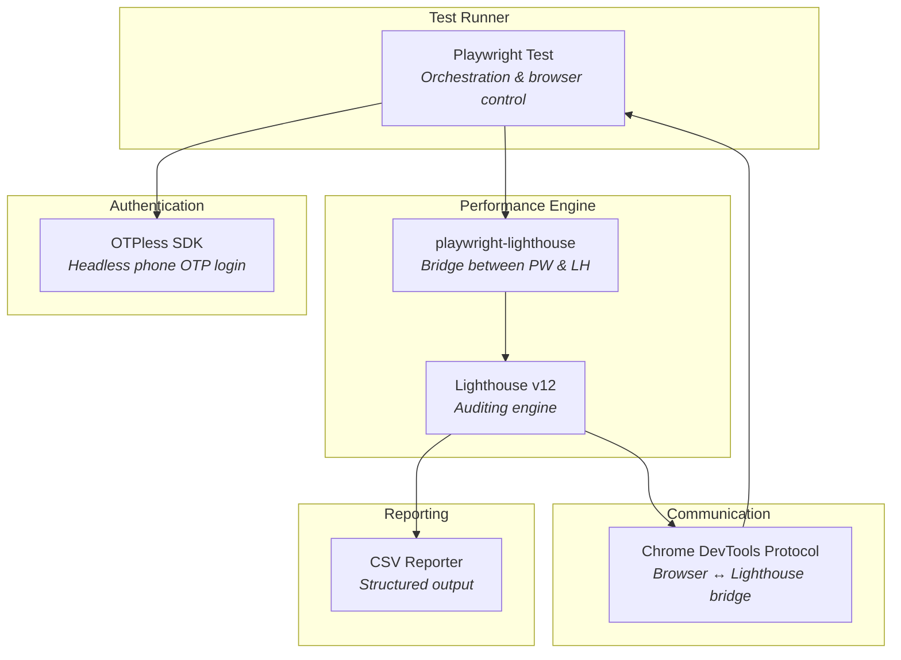
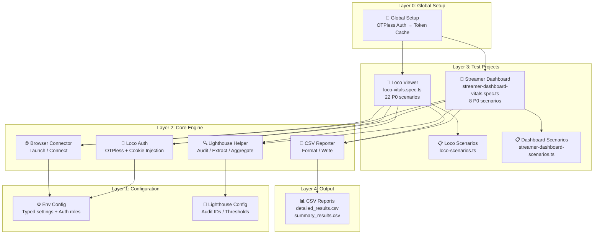
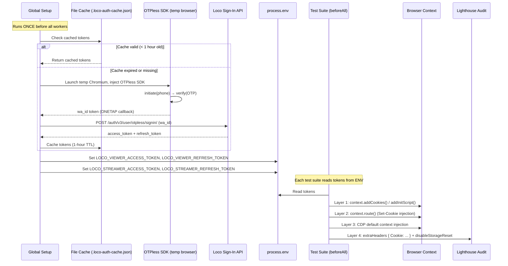
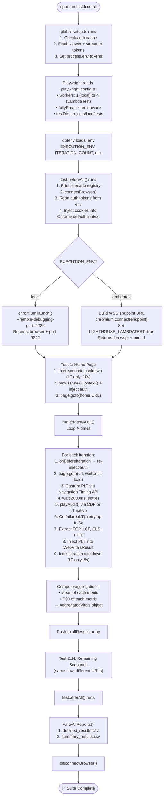
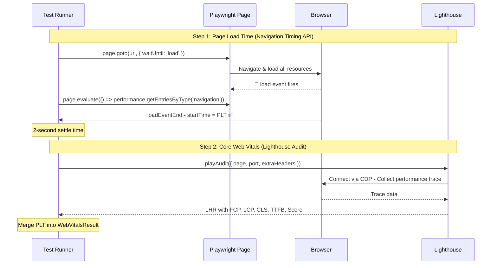
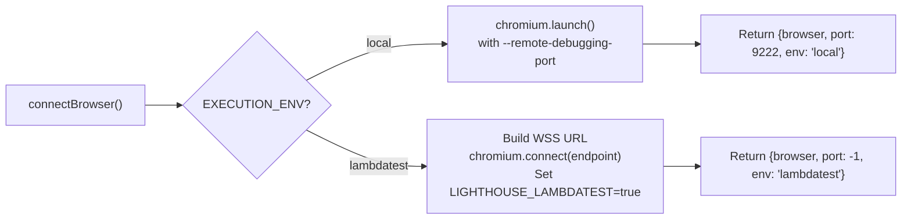

# Performance Automation Framework — Complete Technical Documentation

> **Purpose**: After reading this document, you will understand every performance testing concept used in this framework, how each component works, and how they connect to form an end-to-end automated performance measurement pipeline for the Loco streaming platform and its Streamer Dashboard.

---

## Table of Contents

1. [Performance Testing Fundamentals](#1-performance-testing-fundamentals)
2. [Core Web Vitals — The Metrics That Matter](#2-core-web-vitals--the-metrics-that-matter)
3. [The Technology Stack](#3-the-technology-stack)
4. [Framework Architecture](#4-framework-architecture)
5. [Authentication System](#5-authentication-system)
6. [Execution Pipeline — End to End](#6-execution-pipeline--end-to-end)
7. [Deep Dive: Every File Explained](#7-deep-dive-every-file-explained)
8. [Statistical Aggregation: Mean & P90](#8-statistical-aggregation-mean--p90)
9. [Report System](#9-report-system)
10. [Multi-Tenant Architecture](#10-multi-tenant-architecture)
11. [Running the Framework](#11-running-the-framework)
12. [Extending the Framework](#12-extending-the-framework)
13. [Glossary](#13-glossary)

---

## 1. Performance Testing Fundamentals

### What Is Performance Testing (On the UI Side)?

You're likely familiar with **API performance testing** (load testing, stress testing with tools like JMeter/k6). **UI performance testing is fundamentally different** — it measures **how fast a user perceives a page has loaded**, not server throughput.

| Aspect | API Performance Testing | UI Performance Testing |
|---|---|---|
| **What it measures** | Server response time, throughput, error rate | Visual rendering speed, layout stability, interactivity |
| **Tools** | JMeter, k6, Gatling | Lighthouse, WebPageTest, Chrome DevTools |
| **Perspective** | Server-side | Client-side (browser) |
| **Key metrics** | Requests/sec, latency, P99 | FCP, LCP, CLS, TTFB, PLT |
| **Goal** | "Can the server handle 10K users?" | "Does this page feel fast to one user?" |

### Why Automate UI Performance Testing?

- **Regression detection**: Catch performance degradations before they hit production
- **Baseline establishment**: Know what "normal" looks like for your app
- **Continuous monitoring**: Track trends over time via CSV reports
- **Objective measurement**: Replace "it feels slow" with "LCP is 4200ms (should be <2500ms)"

---

## 2. Core Web Vitals — The Metrics That Matter

Core Web Vitals are Google's standardized metrics for measuring real-world user experience.



### The Five Metrics This Framework Measures

| Metric | Full Name | Unit | What It Measures | Source | Good | Needs Work | Poor |
|--------|-----------|------|-----------------|--------|------|------------|------|
| **FCP** | First Contentful Paint | ms | When the **first text or image** renders on screen | Lighthouse | ≤ 1800ms | 1800–3000ms | > 3000ms |
| **LCP** | Largest Contentful Paint | ms | When the **largest visible element** finishes rendering | Lighthouse | ≤ 2500ms | 2500–4000ms | > 4000ms |
| **CLS** | Cumulative Layout Shift | score | How much the page layout **shifts unexpectedly** | Lighthouse | ≤ 0.1 | 0.1–0.25 | > 0.25 |
| **TTFB** | Time to First Byte | ms | Time from the browser's request to **receiving the first byte** of the response | Lighthouse | ≤ 800ms | 800–1800ms | > 1800ms |
| **PLT** | Page Load Time | ms | Total time from navigation start to the browser's `load` event (all sub-resources fully loaded) | Navigation Timing API | ≤ 3000ms | 3000–6000ms | > 6000ms |

### Visual Timeline: What Happens When a User Opens a Page

```
User hits Enter
    │
    ▼
┌─────────┐
│  TTFB   │  Server processes request, first byte arrives
└────┬────┘
     ▼
┌─────────┐
│  FCP    │  First text/image appears (user sees "something")
└────┬────┘
     ▼
┌─────────┐
│  LCP    │  Hero banner / main content fully rendered
└────┬────┘
     ▼
┌─────────┐
│  CLS    │  Layout shifts measured throughout page lifecycle
└────┬────┘
     ▼
┌─────────┐
│  PLT    │  🔔 load event fires — ALL resources fully loaded
└─────────┘
```

### Why Each Metric Matters for Loco

- **FCP on Home Page**: If a user opens loco.gg and sees a blank screen for 3 seconds, they'll bounce
- **LCP on Livestream Player**: The video player is the largest element — if it takes 5 seconds to render, users leave
- **CLS on Chat**: Chat messages arriving shouldn't push the video player up/down
- **TTFB**: Measures the CDN/server infrastructure health
- **PLT**: The total time for everything to load — gives the complete "page ready" picture

---

## 3. The Technology Stack



### Key Technology Decisions

| Technology | Why It's Used | Alternative Considered |
|---|---|---|
| **Playwright** | Best browser automation tool; native CDP support; TypeScript-first | Puppeteer (less features), Selenium (no CDP) |
| **Lighthouse** | Google's official performance auditing tool; extracts Core Web Vitals | WebPageTest (SaaS-only), custom PerformanceObserver (too low-level) |
| **playwright-lighthouse** | Bridges Playwright's browser instance with Lighthouse via CDP | Manual CDP wiring (complex, error-prone) |
| **TypeScript** | Type safety; IntelliSense; self-documenting interfaces | JavaScript (no type safety) |
| **OTPless SDK** | Headless OTP authentication for Loco login without UI interaction | Manual cookie injection (fragile) |
| **CDP** | Required channel for Lighthouse to instrument the browser | None — Lighthouse requires it |

### What is CDP (Chrome DevTools Protocol)?

CDP is the protocol that Chrome DevTools uses to communicate with the browser.

**Lighthouse needs CDP** to control page navigation, inject performance measurement scripts, collect traces, and extract audit results.

In this framework, the audit path depends on the execution environment:

**Local**: Chrome launches with `--remote-debugging-port=9222`, which opens a CDP endpoint. Lighthouse connects to this port.

```
┌──────────────────┐          CDP (port 9222)         ┌───────────────┐
│   Lighthouse     │ ◄──────────────────────────────► │  Chrome       │
│   Audit Engine   │   "Measure FCP, LCP, CLS..."    │  Browser      │
└──────────────────┘                                   └───────────────┘
```

**LambdaTest**: Direct CDP access is unavailable. `playwright-lighthouse` detects the `LIGHTHOUSE_LAMBDATEST=true` flag and switches to LambdaTest's **native server-side Lighthouse action**.

```
┌──────────────────┐    page.evaluate()     ┌───────────────────────┐
│   playwright-    │ ──────────────────────►│  LambdaTest Cloud     │
│   lighthouse     │   lambdatest_action:   │  (runs Lighthouse     │
│                  │ ◄──────────────────────│   server-side)        │
│                  │   JSON LHR response    └───────────────────────┘
└──────────────────┘
```

---

## 4. Framework Architecture

### Directory Structure

```
Loco_Performance_Automation/
├── config/                                  # ← LAYER 1: Configuration
│   ├── env.config.ts                        #    Environment variables + auth config
│   ├── lighthouse.config.ts                 #    Lighthouse audit settings & thresholds
│   └── index.ts                             #    Barrel export
│
├── utils/                                   # ← LAYER 2: Core Engine
│   ├── browser-connector.ts                 #    Browser launch/connect (local & cloud)
│   ├── lighthouse-helper.ts                 #    Lighthouse audit execution & metric extraction
│   ├── csv-reporter.ts                      #    CSV report generation (detailed + summary)
│   ├── loco-auth.ts                         #    OTPless authentication & cookie/localStorage injection
│   └── index.ts                             #    Barrel export
│
├── projects/                                # ← LAYER 3: Test Projects (Multi-Tenant)
│   ├── loco/                                #    Loco Viewer (preprod.loco.com)
│   │   ├── data/
│   │   │   └── loco-scenarios.ts            #    22 P0 scenario definitions
│   │   └── tests/
│   │       └── loco-vitals.spec.ts          #    Test suite (5 sections, 22 tests)
│   │
│   └── streamer-dashboard/                  #    Streamer Dashboard (dashboard.loco.com)
│       ├── data/
│       │   └── streamer-dashboard-scenarios.ts  #  8 P0 scenario definitions
│       └── tests/
│           └── streamer-dashboard-vitals.spec.ts # Test suite (5 sections, 8 tests)
│
├── reports/                                 # ← LAYER 4: Output
│   ├── loco/
│   │   └── <timestamp>/
│   │       ├── detailed_results.csv
│   │       └── summary_results.csv
│   └── streamer-dashboard/
│       └── <timestamp>/
│           ├── detailed_results.csv
│           └── summary_results.csv
│
├── global.setup.ts                          # Global auth setup (runs once before all workers)
├── playwright.config.ts                     # Playwright runner configuration
├── .env                                     # Environment variables (secrets, settings)
├── .env.example                             # Template for .env
├── .loco-auth-cache.json                    # Cached auth tokens (1-hour TTL)
├── tsconfig.json                            # TypeScript compiler config
└── package.json                             # Dependencies & scripts
```

### Architectural Layers



> [!IMPORTANT]
> **Key Design Decision**: The framework separates concerns into layers. Config knows nothing about tests. Utils know nothing about Loco specifically. The `projects/` directory is the only place with project-specific logic. This multi-tenant architecture lets you add new projects with **zero changes** to shared code.

---

## 5. Authentication System

The framework supports **authenticated performance audits** — measuring page performance as a logged-in user rather than an anonymous guest. This is critical because many Loco pages (Profile, Rewards, Following, Subscriptions) show different content based on auth state.

### Authentication Flow Overview



### Why Multi-Layer Auth Injection?

Lighthouse does **not** inherit cookies from Playwright's isolated browser context. It opens its audit tab in Chrome's **default** context — a completely separate cookie store. The framework uses a **four-layer strategy** to ensure authentication persists:

| Layer | Method | Survives Lighthouse `clearDataForOrigin`? | Target |
|-------|--------|------------------------------------------|--------|
| 1 | `context.addCookies()` / `addInitScript()` | ❌ | Playwright context (warm-up navigation) |
| 2 | `context.route()` with Set-Cookie injection | ✅ (runtime handler, not storage) | All document requests |
| 3 | CDP `Storage.setCookies` / `connectOverCDP` | ❌ (but re-injected before each iteration) | Chrome's default context |
| 4 | Lighthouse `extraHeaders: { Cookie }` | ✅ (sent on every request) | Lighthouse's internal navigation |

### Viewer vs Streamer Auth

The framework supports **two independent auth roles**, each with their own OTPless App ID and credentials:

| Role | Project | Auth Storage | Domain |
|------|---------|--------------|--------|
| **Viewer** | `loco` | Cookies (`access_token`, `refresh_token`, `mode`) | `.loco.com` |
| **Streamer** | `streamer-dashboard` | localStorage (`access_token`, `refresh_token`, `mode`) | `dashboard.loco.com` |

### Token Caching

To avoid hitting the OTPless 5-requests-per-5-minutes rate limit, tokens are cached in `.loco-auth-cache.json` with a **1-hour TTL**. The global setup checks this cache first and only calls the OTPless SDK when tokens have expired.

---

## 6. Execution Pipeline — End to End

Here's **exactly** what happens when you run `npm run test:loco:all`:



### Single Iteration Deep Dive

Inside each iteration, the framework captures **two independent measurements**:



> [!IMPORTANT]
> **Why is PLT captured separately from Lighthouse?** Lighthouse does **not** report a "Page Load Time" metric — its metrics are paint-based (FCP, LCP) or stability-based (CLS). PLT measures the classic `load` event, which represents when **all** sub-resources finish downloading. The two sources are complementary.

> [!NOTE]
> **Why Navigation Timing API instead of Node.js timestamps?** A naive `Date.now()` approach uses **two different clocks** (Node.js and browser) and includes Playwright's CDP serialization overhead (50–200ms noise). The Navigation Timing API runs entirely inside the browser with sub-millisecond precision.

---
## 7. Deep Dive: Every File Explained

### 7.1 env.config.ts — The Centralized Configuration

**Purpose**: Single source of truth for all environment settings. Every module imports `config` from here instead of reading `process.env` directly.

**Key Design**: The `buildConfig()` function returns a **strongly-typed `FrameworkConfig` object** with sensible defaults. If someone forgets to set `ITERATION_COUNT`, it gracefully falls back to `5`.

| Config Key | Env Variable | Default | Purpose |
|---|---|---|---|
| `executionEnv` | `EXECUTION_ENV` | `'local'` | Local browser or LambdaTest cloud |
| `chromeDebugPort` | `CHROME_DEBUG_PORT` | `9222` | CDP port for Lighthouse |
| `headless` | `HEADLESS` | `false` | Whether to show the browser window |
| `iterationCount` | `ITERATION_COUNT` | `5` | How many audits per scenario |
| `lambdatest.*` | `LT_*` | Various | LambdaTest cloud credentials |
| `locoAuth.enabled` | `LOCO_AUTH_ENABLED` | `true` | Enable/disable authenticated audits |
| `locoAuth.viewer.*` | `LOCO_VIEWER_*` | — | OTPless credentials for viewer app |
| `locoAuth.streamer.*` | `LOCO_STREAMER_*` | — | OTPless credentials for streamer app |

The config also defines two typed interfaces for auth roles:

```typescript
interface LocoAuthRoleConfig {
  appId: string;      // OTPless App ID
  phone: string;      // Test phone number
  otp: string;        // Static OTP
  countryCode: string; // e.g. "+55"
}
```

---

### 7.2 lighthouse.config.ts — Audit Configuration

**Purpose**: Maps friendly metric names to Lighthouse internal audit IDs and defines default audit settings.

**`LIGHTHOUSE_AUDIT_IDS`** — The Rosetta Stone between human-readable names and Lighthouse internals:

| Friendly Name | Lighthouse Audit ID | What Lighthouse Returns |
|---|---|---|
| `FCP` | `first-contentful-paint` | `numericValue` in ms |
| `LCP` | `largest-contentful-paint` | `numericValue` in ms |
| `CLS` | `cumulative-layout-shift` | `numericValue` (unitless) |
| `TTFB` | `server-response-time` | `numericValue` in ms |
| `TBT` | `total-blocking-time` | `numericValue` in ms |
| `SI` | `speed-index` | `numericValue` in ms |

**Throttling Configuration** — Desktop-class throttling:
- **RTT**: 40ms · **Throughput**: 10 Mbps · **CPU Slowdown**: 1x (none)
- **Screen**: 1350×940, desktop, no mobile emulation

> [!NOTE]
> **Thresholds are set to `performance: 0`** — tests won't fail based on performance scores. The framework is in **data collection mode**, not **gating mode**.

---

### 7.3 browser-connector.ts — Dual-Environment Browser Management

**Purpose**: Abstracts away the complexity of connecting to a browser whether running locally or on LambdaTest cloud.



**LambdaTest Capabilities** configured automatically: Chrome browser, configurable version/platform, EU region, Turkey geolocation, video recording enabled, console logging on.

**Chrome Launch Flags** (local):

| Flag | Why It's Needed |
|---|---|
| `--remote-debugging-port` | Opens CDP server for Lighthouse |
| `--no-first-run` | Prevents Chrome's "Welcome" dialog |
| `--disable-extensions` | Extensions add noise to performance measurements |
| `--disable-background-networking` | Prevents background updates from distorting metrics |
| `--metrics-recording-only` | Reduces internal Chrome overhead |
| `--mute-audio` | Prevents stream audio from playing during tests |

---

### 7.4 lighthouse-helper.ts — The Measurement Engine

**Purpose**: The heart of the framework. Runs Lighthouse audits, captures Page Load Time via the Navigation Timing API, extracts metrics, and computes aggregations.

#### `runLighthouseAudit()` — Single Audit (with LambdaTest Retry Logic)

1. Calls `playAudit()` from playwright-lighthouse
2. **On LambdaTest**: Retries up to **3 times** with **exponential backoff** (10s → 20s → 40s) for transient server-side failures
3. **On Local**: No retries — single attempt
4. Extracts each metric via `extractMetric()` using the audit ID mapping
5. Converts performance score from 0–1 to 0–100
6. Returns a `WebVitalsResult` (PLT is injected by the caller)
7. If all retries exhausted, returns null-valued metrics (graceful degradation)

**LambdaTest Retry Configuration**:

| Setting | Value | Purpose |
|---|---|---|
| `maxRetries` | 3 | Maximum retry attempts per audit |
| `initialBackoffMs` | 10,000ms | Initial wait (doubles each retry) |
| `cooldownMs` | 5,000ms | Pause between consecutive iterations |

```
Attempt 1 → fail → wait 10s →
Attempt 2 → fail → wait 20s →
Attempt 3 → fail → wait 40s →
Attempt 4 → fail → return null metrics (graceful degradation)
```

#### `runIteratedAudit()` — Multiple Audits with Aggregation

1. Loops `N` times (from `ITERATION_COUNT`)
2. Calls optional `onBeforeIteration` hook (used for re-injecting auth cookies)
3. Navigates fresh with `page.goto(url, { waitUntil: 'load' })`
4. **Captures PLT** via `page.evaluate()` using the Navigation Timing API
5. Waits 2 seconds for settle
6. Calls `runLighthouseAudit()` with the captured PLT
7. **On LambdaTest**: 5-second cooldown between iterations
8. Computes **mean** and **P90** for all metrics
9. Returns an `AggregatedVitals` object

Accepts optional `lighthouseConfig` for authenticated audits (`extraHeaders`, `disableStorageReset`).

> [!IMPORTANT]
> **Why multiple iterations?** A single Lighthouse audit can vary by ±20% due to network conditions, CPU load, and browser state. Running 3–5 iterations and averaging eliminates noise.

**Type Hierarchy**:

```
WebVitalsResult (single iteration)
  ├── fcp: number | null          ← from Lighthouse
  ├── lcp: number | null          ← from Lighthouse
  ├── cls: number | null          ← from Lighthouse
  ├── ttfb: number | null         ← from Lighthouse
  ├── pageLoadTime: number | null ← from Navigation Timing API
  ├── performanceScore: number | null
  └── timestamp: string

AggregatedVitals (across N iterations)
  ├── scenario: string
  ├── url: string
  ├── totalIterations: number
  ├── iterations: WebVitalsResult[]
  ├── averages: { fcp, lcp, cls, ttfb, pageLoadTime, performanceScore }
  └── p90: { fcp, lcp, cls, ttfb, pageLoadTime }
```

---

### 7.5 loco-auth.ts — Authentication Engine

**Purpose**: Complete headless authentication flow using OTPless SDK + Loco sign-in API, plus multi-layer cookie/localStorage injection.

**Core Functions**:

| Function | Purpose |
|---|---|
| `getLocoTokens()` | End-to-end OTPless flow → returns `{ accessToken, refreshToken }` |
| `injectAuthCookies()` | Sets cookies in a Playwright `BrowserContext` |
| `injectAuthCookiesIntoBrowserDefault()` | Sets cookies in Chrome's DEFAULT context via `connectOverCDP` (local) |
| `injectAuthCookiesViaStorageCDP()` | Sets cookies via `browser.newBrowserCDPSession()` + `Storage.setCookies` (LambdaTest) |
| `injectAuthCookiesViaRoutes()` | Intercepts loco.com document requests and injects `Set-Cookie` headers (survives Lighthouse storage resets) |
| `injectAuthLocalStorage()` | Sets tokens in localStorage via `context.addInitScript()` (for Streamer Dashboard) |
| `injectAuthLocalStorageIntoBrowserDefault()` | Sets localStorage in Chrome's default context via temp page (local) |
| `injectAuthLocalStorageViaRoutes()` | Injects a `<script>` tag into HTML responses to set localStorage (LambdaTest) |

---

### 7.6 csv-reporter.ts — Structured Output

**Purpose**: Generates two CSV files per test run for historical analysis.

| File | Granularity | Key Columns | Use Case |
|---|---|---|---|
| `detailed_results.csv` | One row per **iteration** | Scenario, URL, Iteration, FCP, LCP, CLS, TTFB, PLT, Score, Timestamp | Debugging; variance analysis |
| `summary_results.csv` | One row per **scenario** | Scenario, URL, Iterations, Avg/P90 of all metrics, Run Date | Dashboarding; trend tracking |

**Parallel-Safe**: Uses `RUN_TIMESTAMP` from `process.env` (set in `playwright.config.ts`) so parallel workers write to the same timestamped directory. Uses `fs.appendFileSync` to safely append rows.

**Output Path**: `reports/<project>/<timestamp>/` — Each run creates a new timestamped directory, never overwriting history.

---

### 7.7 Scenario Registries

#### Loco Viewer — 22 P0 Scenarios (loco-scenarios.ts)

| Section | Scenarios |
|---|---|
| **Home** (6) | Home Page, Live Now, Videos, Rewards, Quests, Emerging Streamers |
| **Streamer** (4) | Streamer Profile, Channel Preview, Leaderboard, Battles |
| **Player** (6) | Livestream Player, VOD Player, Livestream Leaderboard, Livestream Quests, Livestream Battles, Livestream Drops |
| **Categories** (4) | Categories Section, PH Slots & Casino, BR Free Fire, First Search Fetch Time |
| **User Profile** (3) | My Profile, Following, Subscriptions |

#### Streamer Dashboard — 8 P0 Scenarios (streamer-dashboard-scenarios.ts)

| Section | Scenarios |
|---|---|
| **Stream** (1) | Live Stream |
| **Ads** (2) | Ads & Affiliates, Analytics |
| **Moderator** (4) | Moderator, Blocked Words, Muted Users, Activities |
| **Subscriptions** (1) | Subscription Tab |
| **Leaderboard** (1) | Leaderboard |

Each scenario contains: `id`, `name`, `url`, `section`, `description`, `priority`, `enabled`, `tags`.

Helper functions: `getEnabledScenarios(tag?)`, `getScenarioById(id)`, `printScenarioRegistry()`.

---

### 7.8 Test Specifications

Both test specs (`loco-vitals.spec.ts` and `streamer-dashboard-vitals.spec.ts`) follow the same pattern:

```
beforeAll()
  ├── Print scenario registry
  ├── connectBrowser()
  ├── Read auth tokens from process.env
  └── Inject auth into Chrome's default context

test("Scenario Name")
  ├── LambdaTest inter-scenario cooldown (10s, skipped for first)
  ├── browser.newContext() with auth injection
  ├── Warm-up navigation
  ├── runIteratedAudit() with auth config
  │   └── onBeforeIteration: re-inject auth cookies
  └── Push results to allResults[]

afterAll()
  ├── writeAllReports(allResults)
  └── disconnectBrowser()
```

> [!NOTE]
> **Browser Context Isolation**: Each test creates a fresh `newContext()` to avoid cache/cookie leakage between scenarios.

---

### 7.9 global.setup.ts — Pre-Suite Authentication

**Purpose**: Runs **once before all workers** to fetch auth tokens via OTPless, avoiding rate limits when parallel workers each try to authenticate independently.

**Smart project detection**: Parses `process.argv` to determine which projects are being run, and only fetches tokens for the needed roles (viewer, streamer, or both).

**Token caching**: Reads/writes `.loco-auth-cache.json` with a 1-hour TTL to avoid unnecessary OTPless API calls across consecutive runs.

---

### 7.10 playwright.config.ts — Runner Configuration

| Setting | Local Value | LambdaTest Value | Why |
|---|---|---|---|
| `workers` | `1` | `4` (configurable via `WORKERS` env) | Local: CDP port collision. LT: isolated containers |
| `fullyParallel` | `false` | `true` | LT workers get independent browser instances |
| `retries` | `0` | `0` | Flaky perf results indicate real issues |
| `timeout` | `iterations × 45s + 60s` | `iterations × 120s + 120s` | LT accounts for retry backoff + cooldowns |
| `globalSetup` | `global.setup.ts` | `global.setup.ts` | Auth tokens fetched once before all workers |

> [!WARNING]
> **Never set `workers > 1` for local runs**. All workers would try to use CDP port 9222 simultaneously, causing audit failures.

---

## 8. Statistical Aggregation: Mean & P90

### Why Average Alone Isn't Enough

A single outlier can skew an average dramatically. The framework computes both **Mean** and **P90**.

| Metric | Definition | What It Tells You |
|---|---|---|
| **Mean** | Sum ÷ Count | "What does the typical experience look like?" |
| **P90** | 90% of values fall below this | "What does the worst 10% of experiences look like?" |

**Example** (Home Page, 3 iterations):

| | Iter 1 | Iter 2 | Iter 3 | **Mean** | **P90** |
|---|---|---|---|---|---|
| FCP | 1111ms | 22ms | 249ms | **461ms** | **1111ms** |
| LCP | 6350ms | 1560ms | 1659ms | **3190ms** | **6350ms** |

The Mean says "average FCP is 461ms (good!)". The P90 says "but 10% of users see 1111ms (borderline)". **Both numbers are needed.**

### P90 Calculation

```typescript
function percentile(values, p) {
  const sorted = values.filter(v => v !== null).sort((a, b) => a - b);
  const idx = Math.ceil((p / 100) * sorted.length) - 1;
  return sorted[Math.max(0, idx)];
}
```

Null values are filtered out before computation so failed iterations don't corrupt statistics.

---

## 9. Report System

### Output Structure

```
reports/
├── loco/
│   ├── 2026_04_03_10_36_57/
│   │   ├── detailed_results.csv
│   │   └── summary_results.csv
│   └── 2026_05_13_07_04_45/
│       ├── detailed_results.csv
│       └── summary_results.csv
└── streamer-dashboard/
    └── 2026_05_07_12_15_30/
        ├── detailed_results.csv
        └── summary_results.csv
```

Each run gets a **timestamped directory**, building a historical archive automatically. Feed these CSVs into Google Sheets, Grafana, or any dashboarding tool.

---

## 10. Multi-Tenant Architecture

The framework is designed so that **Loco Viewer and Streamer Dashboard are separate "tenants"**. To add a new application:

```
projects/
├── loco/                              ← Existing tenant (cookies)
├── streamer-dashboard/                ← Existing tenant (localStorage)
└── new-app/                           ← New tenant (you create this)
    ├── data/new-app-scenarios.ts
    └── tests/new-app-vitals.spec.ts
```

Then add a project entry in `playwright.config.ts`:

```typescript
{
  name: 'new-app-performance',
  testDir: './projects/new-app/tests',
  testMatch: '**/*.spec.ts',
}
```

**Zero changes needed** in `config/`, `utils/`, or any shared code.

---

## 11. Running the Framework

### NPM Scripts

| Command | What It Does |
|---|---|
| `npm run test:loco:all` | Run all 22 Loco viewer scenarios |
| `npm run test:loco:home-section` | Run Home section (6 scenarios) |
| `npm run test:loco:streamer-section` | Run Streamer section (4 scenarios) |
| `npm run test:loco:player-section` | Run Player section (6 scenarios) |
| `npm run test:loco:categories-section` | Run Categories section (4 scenarios) |
| `npm run test:loco:user-profile-section` | Run User Profile section (3 scenarios) |
| `npm run test:loco:home` | Run only Home Page |
| `npm run test:loco:rewards` | Run only Rewards |
| `npm run test:loco:livestream` | Run only Livestream Player |
| `npm run test:loco:vod` | Run only VOD Player |
| `npm run test:streamer-dashboard:stream-section` | Run Stream section |
| `npm run test:streamer-dashboard:ads-section` | Run Ads section |
| `npm run test:streamer-dashboard:moderator-section` | Run Moderator section |
| `npm run test:streamer-dashboard:subscriptions-section` | Run Subscriptions section |
| `npm run test:streamer-dashboard:leaderboard-section` | Run Leaderboard section |
| `npm run test` | Run all tests across all projects |
| `npm run report:open` | Open the Playwright HTML report |
| `npm run lint` | TypeScript type check (no emit) |

### Environment Variables (`.env`)

| Variable | Values | Default | Effect |
|---|---|---|---|
| `EXECUTION_ENV` | `local` / `lambdatest` | `local` | Where the browser runs |
| `ITERATION_COUNT` | Any integer | `5` | Lighthouse audits per scenario |
| `HEADLESS` | `true` / `false` | `false` | Show/hide browser (local only) |
| `CHROME_DEBUG_PORT` | Port number | `9222` | CDP port |
| `WORKERS` | Integer | `4` | LambdaTest parallel workers |
| `LOCO_AUTH_ENABLED` | `true` / `false` | `true` | Enable authenticated audits |
| `LOCO_AUTH_CLIENT_ID` | String | — | Shared Loco sign-in client ID |
| `LOCO_AUTH_CLIENT_SECRET` | String | — | Shared Loco sign-in client secret |
| `LOCO_VIEWER_APP_ID` | String | — | OTPless App ID for viewer |
| `LOCO_VIEWER_PHONE` | String | — | Test phone number for viewer |
| `LOCO_VIEWER_OTP` | String | — | Static OTP for viewer |
| `LOCO_STREAMER_APP_ID` | String | — | OTPless App ID for streamer |
| `LOCO_STREAMER_PHONE` | String | — | Test phone number for streamer |
| `LOCO_STREAMER_OTP` | String | — | Static OTP for streamer |

> [!NOTE]
> **`LIGHTHOUSE_LAMBDATEST`** is set **automatically** by the browser connector when `EXECUTION_ENV=lambdatest`. You do not set it in `.env`.

### Quick Start

```bash
# 1. Clone and install
git clone <repo-url>
cd Loco_Performance_Automation
npm install

# 2. Configure environment
cp .env.example .env
# Edit .env with your credentials

# 3. Run all Loco scenarios
npm run test:loco:all

# 4. Run a single scenario
npm run test:loco:home

# 5. Run Streamer Dashboard
npm run test:streamer-dashboard:stream-section

# 6. View the Playwright report
npm run report:open
```

---

## 12. Extending the Framework

### Adding a New Test Scenario

1. Add entry to the scenario registry (e.g., `loco-scenarios.ts`):

```typescript
NEW_PAGE: {
  id: 'new-page',
  name: 'New Page',
  url: `${LOCO_BASE_URL}/new-page`,
  section: 'Home',
  description: 'Description of what this page tests',
  priority: 'P0',
  enabled: true,
  tags: ['home', 'core'],
},
```

2. Add a test block in the spec file:

```typescript
test('New Page — Core Web Vitals', async () => {
  await runScenarioAudit(LOCO_SCENARIOS.NEW_PAGE, '🆕');
});
```

### Enabling Performance Gating

Change `lighthouse.config.ts` thresholds from data-collection to gating mode:

```typescript
export const DEFAULT_THRESHOLDS = {
  performance: 70,  // Fail if score < 70
};
```

### Disabling Authentication

Set `LOCO_AUTH_ENABLED=false` in `.env` to run all audits as an anonymous guest.

---

## 13. Glossary

| Term | Definition |
|---|---|
| **CDP** | Chrome DevTools Protocol — the API for controlling/inspecting Chrome |
| **Core Web Vitals** | Google's main UX metrics: LCP, CLS, and their supporting indicators |
| **FCP** | First Contentful Paint — when the first content renders |
| **LCP** | Largest Contentful Paint — when the main content renders |
| **CLS** | Cumulative Layout Shift — visual stability score |
| **TTFB** | Time to First Byte — server response speed |
| **PLT** | Page Load Time — total time from navigation start to the browser's `load` event |
| **Navigation Timing API** | W3C browser API providing precise page load timing data |
| **`loadEventEnd`** | Timestamp when the browser's `load` event handler finishes |
| **LHR** | Lighthouse Result — the full audit output object |
| **P90** | 90th Percentile — the value below which 90% of observations fall |
| **Lighthouse** | Google's open-source auditing tool for web page quality |
| **playwright-lighthouse** | NPM bridge that runs Lighthouse through a Playwright-controlled browser |
| **`playAudit()`** | Function from playwright-lighthouse that executes an audit |
| **OTPless** | Third-party SDK for phone OTP-based authentication |
| **`wa_id`** | Token returned by OTPless ONETAP callback, exchanged for Loco session tokens |
| **`page.evaluate()`** | Playwright method that executes JavaScript inside the browser context |
| **Multi-tenant** | Architecture pattern where one framework supports multiple independent projects |
| **Barrel export** | An `index.ts` file that re-exports from multiple modules for cleaner imports |
| **Throttling** | Simulating slower network/CPU to test under realistic conditions |
| **`disableStorageReset`** | Lighthouse flag that prevents clearing cookies before audit |
| **`extraHeaders`** | Lighthouse flag that attaches custom HTTP headers to every audit request |
