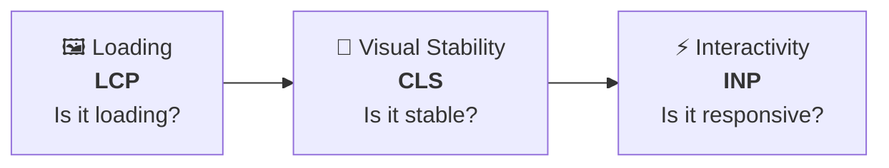
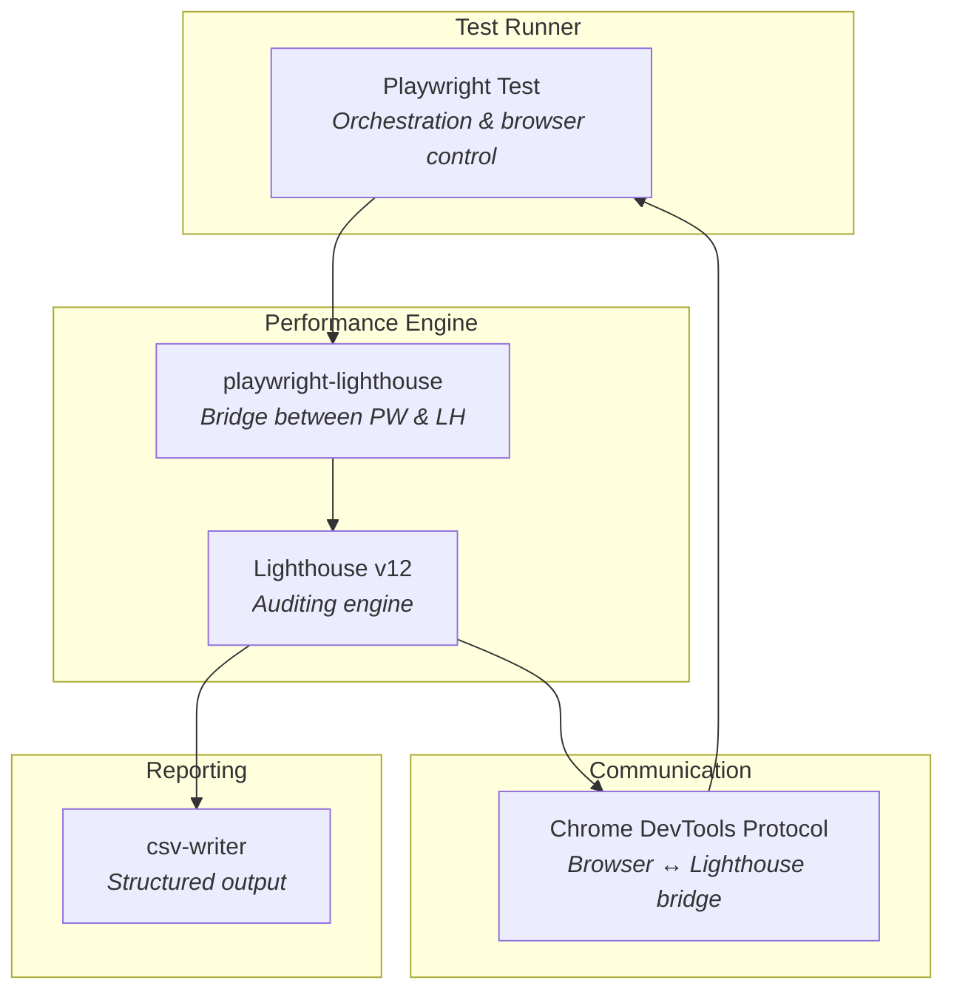
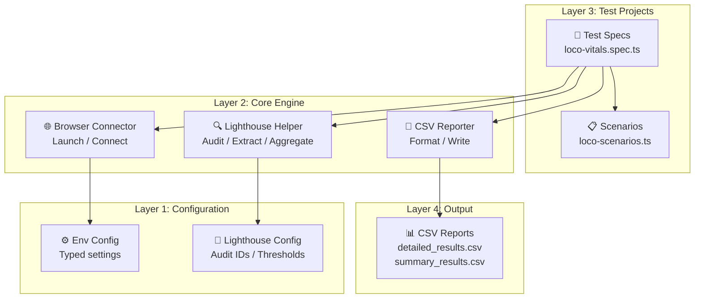
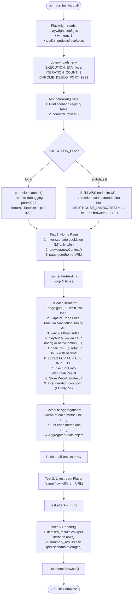
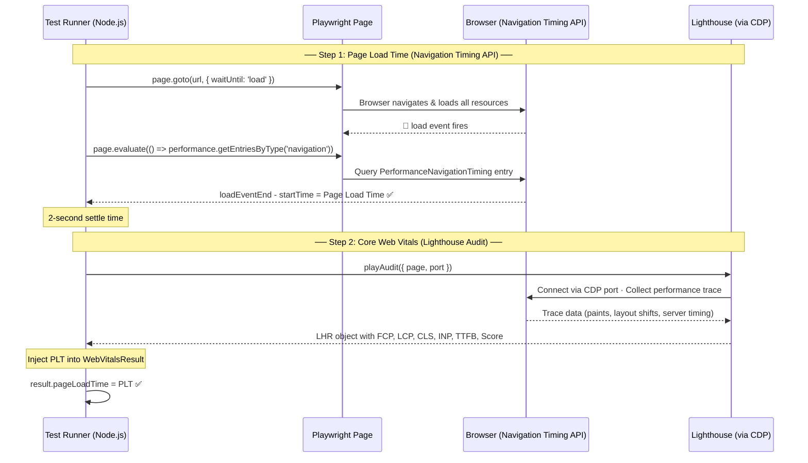
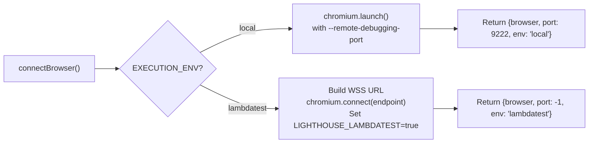

# Performance Automation Framework — Complete Technical Documentation

> **Purpose**: After reading this document, you will understand every performance testing concept used in this framework, how each component works, and how they connect to form an end-to-end automated performance measurement pipeline.

---

## Table of Contents

1. [Performance Testing Fundamentals](#1-performance-testing-fundamentals)
2. [Core Web Vitals — The Metrics That Matter](#2-core-web-vitals)
3. [The Technology Stack](#3-the-technology-stack)
4. [Framework Architecture](#4-framework-architecture)
5. [Execution Pipeline — End to End](#5-execution-pipeline)
6. [Deep Dive: Every File Explained](#6-deep-dive-every-file)
7. [Statistical Aggregation: Mean & P90](#7-statistical-aggregation)
8. [Report System](#8-report-system)
9. [Multi-Tenant Architecture](#9-multi-tenant-architecture)
10. [Running the Framework](#10-running-the-framework)
11. [Extending the Framework](#11-extending-the-framework)
12. [Glossary](#12-glossary)

---

## 1. Performance Testing Fundamentals

### What Is Performance Testing (On the UI Side)?

You're likely familiar with **API performance testing** (load testing, stress testing with tools like JMeter/k6). **UI performance testing is fundamentally different** — it measures **how fast a user perceives a page has loaded**, not server throughput.

| Aspect | API Performance Testing | UI Performance Testing |
|---|---|---|
| **What it measures** | Server response time, throughput, error rate | Visual rendering speed, layout stability, interactivity |
| **Tools** | JMeter, k6, Gatling | Lighthouse, WebPageTest, Chrome DevTools |
| **Perspective** | Server-side | Client-side (browser) |
| **Key metrics** | Requests/sec, latency, P99 | FCP, LCP, CLS, INP, TTFB |
| **Goal** | "Can the server handle 10K users?" | "Does this page feel fast to one user?" |

### Why Automate UI Performance Testing?

- **Regression detection**: Catch performance degradations before they hit production
- **Baseline establishment**: Know what "normal" looks like for your app
- **Continuous monitoring**: Track trends over time via CSV reports
- **Objective measurement**: Replace "it feels slow" with "LCP is 4200ms (should be <2500ms)"

---

## 2. Core Web Vitals

Core Web Vitals are Google's standardized metrics for measuring real-world user experience. They answer three fundamental questions:



### The Six Metrics This Framework Measures

| Metric | Full Name | Unit | What It Measures | Source | Good | Needs Work | Poor |
|--------|-----------|------|-----------------|--------|------|------------|------|
| **FCP** | First Contentful Paint | ms | When the **first text or image** renders on screen | Lighthouse | ≤ 1800ms | 1800–3000ms | > 3000ms |
| **LCP** | Largest Contentful Paint | ms | When the **largest visible element** (hero image, video player) finishes rendering | Lighthouse | ≤ 2500ms | 2500–4000ms | > 4000ms |
| **CLS** | Cumulative Layout Shift | score | How much the page layout **shifts unexpectedly** (elements jumping around) | Lighthouse | ≤ 0.1 | 0.1–0.25 | > 0.25 |
| **INP** | Interaction to Next Paint | ms | Time from user interaction (click/tap) to the **next visual update** | Lighthouse | ≤ 200ms | 200–500ms | > 500ms |
| **TTFB** | Time to First Byte | ms | Time from the browser's request to **receiving the first byte** of the response from the server | Lighthouse | ≤ 800ms | 800–1800ms | > 1800ms |
| **PLT** | Page Load Time | ms | Total time from navigation start to the browser's `load` event (all sub-resources — images, CSS, JS, iframes — fully loaded) | Navigation Timing API | ≤ 3000ms | 3000–6000ms | > 6000ms |

### Visual Timeline: What Happens When a User Opens a Page

```
User hits Enter
    │
    ▼
┌─────────┐
│  TTFB   │  Server processes request, first byte arrives
└────┬────┘
     ▼
┌─────────┐
│  FCP    │  First text/image appears (user sees "something")
└────┬────┘
     ▼
┌─────────┐
│  LCP    │  Hero banner / main content fully rendered
└────┬────┘
     ▼
┌─────────┐
│  CLS    │  Layout shifts measured throughout page lifecycle
└────┬────┘
     ▼
┌─────────┐
│  PLT    │  🔔 load event fires — ALL resources fully loaded
└────┬────┘
     ▼
┌─────────┐
│  INP    │  User clicks → how fast does the UI respond?
└─────────┘
```

### Why Each Metric Matters for Loco

- **FCP on Home Page**: If a user opens loco.gg and sees a blank screen for 3 seconds, they'll bounce
- **LCP on Livestream Player**: The video player is the largest element — if it takes 5 seconds to render, users leave
- **CLS on Chat**: Chat messages arriving shouldn't push the video player up/down
- **INP**: When a user clicks "Subscribe" or a category filter, the UI must respond instantly
- **TTFB**: Measures the CDN/server infrastructure health
- **PLT**: The total time for everything to load — gives the complete "page ready" picture that complements the paint-based milestones above

---

## 3. The Technology Stack



### Key Technology Decisions

| Technology | Why It's Used | Alternative Considered |
|---|---|---|
| **Playwright** | Best browser automation tool; native CDP support; TypeScript-first | Puppeteer (less features), Selenium (no CDP) |
| **Lighthouse** | Google's official performance auditing tool; extracts Core Web Vitals | WebPageTest (SaaS-only), custom PerformanceObserver (too low-level) |
| **playwright-lighthouse** | Bridges Playwright's browser instance with Lighthouse via CDP | Manual CDP wiring (complex, error-prone) |
| **TypeScript** | Type safety; IntelliSense; self-documenting interfaces | JavaScript (no type safety) |
| **CDP (Chrome DevTools Protocol)** | Required channel for Lighthouse to instrument the browser | None — Lighthouse requires it |

### What is CDP (Chrome DevTools Protocol)?

CDP is the protocol that Chrome DevTools uses to communicate with the browser. When you open DevTools and see network requests, performance profiles, etc., that data flows via CDP.

**Lighthouse needs CDP** to:
- Control page navigation
- Inject performance measurement scripts
- Collect traces and timing data
- Extract audit results

In this framework, the audit path depends on the execution environment:

**Local**: We launch Chrome with `--remote-debugging-port=9222`, which opens a CDP endpoint at `localhost:9222`. Lighthouse connects to this port to run its audits.

```
┌──────────────────┐          CDP (port 9222)         ┌───────────────┐
│   Lighthouse     │ ◄──────────────────────────────► │  Chrome       │
│   Audit Engine   │   "Measure FCP, LCP, CLS..."    │  Browser      │
└──────────────────┘                                   └───────────────┘
```

**LambdaTest**: Direct CDP access is not available on remote cloud browsers. Instead, `playwright-lighthouse` detects the `LIGHTHOUSE_LAMBDATEST=true` environment variable and switches to LambdaTest's **native Lighthouse action** — a server-side audit triggered via `page.evaluate()` with a special `lambdatest_action` command.

```
┌──────────────────┐    page.evaluate()     ┌───────────────────────┐
│   playwright-    │ ──────────────────────►│  LambdaTest Cloud     │
│   lighthouse     │   lambdatest_action:   │  (runs Lighthouse     │
│                  │ ◄──────────────────────│   server-side)        │
│                  │   JSON LHR response    └───────────────────────┘
└──────────────────┘
```

---

## 4. Framework Architecture

### Directory Structure

```
Loco_Performance_Automation/
├── config/                         # ← LAYER 1: Configuration
│   ├── env.config.ts               #    Environment variables (local vs LambdaTest)
│   ├── lighthouse.config.ts        #    Lighthouse audit settings & thresholds
│   └── index.ts                    #    Barrel export
│
├── utils/                          # ← LAYER 2: Core Engine
│   ├── browser-connector.ts        #    Browser launch/connect (local & cloud)
│   ├── lighthouse-helper.ts        #    Lighthouse audit execution & metric extraction
│   ├── csv-reporter.ts             #    CSV report generation (detailed + summary)
│   └── index.ts                    #    Barrel export
│
├── projects/                       # ← LAYER 3: Test Projects (Multi-Tenant)
│   └── loco/
│       ├── data/
│       │   └── loco-scenarios.ts   #    URL registry & scenario definitions
│       └── tests/
│           └── loco-vitals.spec.ts #    Playwright test specification
│
├── reports/                        # ← LAYER 4: Output
│   └── loco/
│       └── 2026_04_06_07_04_45/
│           ├── detailed_results.csv
│           └── summary_results.csv
│
├── playwright.config.ts            # Playwright runner configuration
├── .env                            # Environment variables (secrets, settings)
├── .env.example                    # Template for .env
├── tsconfig.json                   # TypeScript compiler config
└── package.json                    # Dependencies & scripts
```

### Architectural Layers



> [!IMPORTANT]
> **Key Design Decision**: The framework separates concerns into layers. Config knows nothing about tests. Utils know nothing about Loco specifically. The `projects/loco/` directory is the only place with Loco-specific logic. This is the **multi-tenant architecture** that lets you add new projects easily.

---

## 5. Execution Pipeline

This is the most important section. Here's **exactly** what happens when you run `npm run test:loco:all`:



### Single Iteration Deep Dive

Inside each iteration, the framework captures **two independent measurements** — Page Load Time (via browser-native API) and Core Web Vitals (via Lighthouse):



Here's the same flow at the protocol/code level:

```
1. Playwright navigates to URL
   └─► page.goto(url, { waitUntil: 'load' })
   └─► Waits until the browser's load event fires
       (all sub-resources — images, CSS, JS, iframes — fully loaded)

2. Page Load Time captured via Navigation Timing API
   └─► page.evaluate(() => {
         const entry = performance.getEntriesByType('navigation')[0];
         return entry.loadEventEnd - entry.startTime;
       })
   └─► Uses the browser's own high-resolution clock (not Node.js timestamps)
   └─► Sub-millisecond precision, zero Playwright overhead

3. 2-second settle time
   └─► Ensures late-loading content (ads, analytics) has finished

4. playAudit() is called
   └─► playwright-lighthouse connects to CDP port 9222
   └─► Lighthouse takes over the page:
       a. Collects a performance trace
       b. Simulates a fresh page load internally
       c. Measures paint timings (FCP, LCP)
       d. Measures layout shifts (CLS)
       e. Measures server response (TTFB)
       f. Computes an overall Performance Score (0-100)

5. Results returned as LHR (Lighthouse Result) object
   └─► lhr.audits['first-contentful-paint'].numericValue → FCP
   └─► lhr.audits['largest-contentful-paint'].numericValue → LCP
   └─► lhr.audits['cumulative-layout-shift'].numericValue → CLS
   └─► lhr.audits['interaction-to-next-paint'].numericValue → INP
   └─► lhr.audits['server-response-time'].numericValue → TTFB
   └─► lhr.categories.performance.score × 100 → Score

6. PLT injected into the result
   └─► result.pageLoadTime = pageLoadTime (from step 2)
```

> [!IMPORTANT]
> **Why is PLT captured separately from Lighthouse?**
> Lighthouse does **not** report a "Page Load Time" metric — its metrics are paint-based (FCP, LCP) or interaction-based (INP, CLS). PLT measures the classic `load` event, which represents when **all** sub-resources finish downloading. The two measurement sources are complementary: Lighthouse tells you about perceived speed; PLT tells you about total resource loading time.

> [!NOTE]
> **Why Navigation Timing API instead of Node.js timestamps?**
> A naive approach would be `const start = Date.now(); await page.goto(...); const plt = Date.now() - start;`. This is inaccurate because it uses **two different clocks** (Node.js and browser) and includes Playwright's CDP command serialization overhead (50–200ms noise). The Navigation Timing API runs entirely inside the browser, using a single high-resolution clock with sub-millisecond precision.

---

## 6. Deep Dive: Every File Explained

### 6.1 [env.config.ts](file:///Users/harsh/Documents/GitHub/Loco_Performance_Automation/config/env.config.ts) — The Centralized Configuration

**Purpose**: Single source of truth for all environment settings. Every module imports `config` from here instead of reading `process.env` directly.

**Key Design**: The `buildConfig()` function returns a **strongly-typed `FrameworkConfig` object** with sensible defaults. This means if someone forgets to set `ITERATION_COUNT`, it gracefully falls back to `5` instead of crashing.

| Config Key | Env Variable | Default | Purpose |
|---|---|---|---|
| `executionEnv` | `EXECUTION_ENV` | `'local'` | Local browser or LambdaTest cloud |
| `chromeDebugPort` | `CHROME_DEBUG_PORT` | `9222` | CDP port for Lighthouse |
| `headless` | `HEADLESS` | `false` | Whether to show the browser window |
| `iterationCount` | `ITERATION_COUNT` | `5` | How many audits per scenario |
| `lambdatest.*` | `LT_*` | Various | LambdaTest cloud credentials |

---

### 6.2 [lighthouse.config.ts](file:///Users/harsh/Documents/GitHub/Loco_Performance_Automation/config/lighthouse.config.ts) — Audit Configuration

**Purpose**: Maps friendly metric names to Lighthouse internal audit IDs and defines default audit settings.

**`LIGHTHOUSE_AUDIT_IDS`** — This is the Rosetta Stone between human-readable names and Lighthouse's internal identifiers:

| Friendly Name | Lighthouse Audit ID | What Lighthouse Returns |
|---|---|---|
| `FCP` | `first-contentful-paint` | `numericValue` in ms |
| `LCP` | `largest-contentful-paint` | `numericValue` in ms |
| `CLS` | `cumulative-layout-shift` | `numericValue` (unitless) |
| `INP` | `interaction-to-next-paint` | `numericValue` in ms |
| `TTFB` | `server-response-time` | `numericValue` in ms |

**Throttling Configuration** — The framework uses **desktop-class throttling**:
- **RTT**: 40ms (round-trip latency)
- **Throughput**: 10 Mbps
- **CPU Slowdown**: 1x (no CPU throttling)

> [!NOTE]
> **Thresholds are set to `performance: 0`** — this means tests won't fail based on performance scores. The framework is in **data collection mode**, not **gating mode**. You're gathering baselines, not blocking deploys (yet).

---

### 6.3 [browser-connector.ts](file:///Users/harsh/Documents/GitHub/Loco_Performance_Automation/utils/browser-connector.ts) — Dual-Environment Browser Management

**Purpose**: Abstracts away the complexity of connecting to a browser whether running locally or on LambdaTest cloud.



**Why `--remote-debugging-port`?**
When Chrome launches normally, there's no way for external tools to inspect it. The `--remote-debugging-port` flag opens a CDP server inside Chrome. Lighthouse connects to this server to run its audits. Without this flag, Lighthouse cannot function.

**LambdaTest `LIGHTHOUSE_LAMBDATEST` flag**: When `EXECUTION_ENV=lambdatest`, the browser connector automatically sets `process.env.LIGHTHOUSE_LAMBDATEST = 'true'`. This signals `playwright-lighthouse` to use LambdaTest's **native server-side Lighthouse action** instead of trying to connect via a local CDP port (which isn't available on remote cloud browsers).

**Additional launch flags explained** (local only):

| Flag | Why It's Needed |
|---|---|
| `--no-first-run` | Prevents Chrome's "Welcome" dialog |
| `--disable-extensions` | Extensions add noise to performance measurements |
| `--disable-background-networking` | Prevents background updates from distorting metrics |
| `--metrics-recording-only` | Reduces internal Chrome overhead |
| `--mute-audio` | Prevents stream audio from playing during tests |

---

### 6.4 [lighthouse-helper.ts](file:///Users/harsh/Documents/GitHub/Loco_Performance_Automation/utils/lighthouse-helper.ts) — The Measurement Engine

**Purpose**: The heart of the framework. Runs Lighthouse audits, captures Page Load Time via the Navigation Timing API, extracts metrics, and computes aggregations.

**Two key functions**:

#### `runLighthouseAudit()` — Single Lighthouse Audit (with LambdaTest Retry Logic)
1. Calls `playAudit()` from playwright-lighthouse
2. **On LambdaTest**: If the audit fails (LambdaTest intermittently returns `500 Internal Server Error: "Failed to generate lighthouse report"`), the function retries up to **3 times** with **exponential backoff** (10s → 20s → 40s). Before each retry, the page is re-navigated to reset state.
3. **On Local**: No retries — runs once. Failures indicate real issues.
4. Receives the full Lighthouse Result (LHR) object
5. Extracts each metric via `extractMetric()` using the audit ID mapping
6. Converts performance score from 0–1 scale to 0–100
7. Returns a `WebVitalsResult` with all five Lighthouse metrics + score + timestamp (PLT is set to `null` — it's injected by the caller)
8. If all retries are exhausted, returns null-valued metrics (graceful degradation — does not break the aggregation pipeline)

**LambdaTest Retry Configuration** (defined in `LAMBDATEST_RETRY_CONFIG`):
| Setting | Value | Purpose |
|---|---|---|
| `maxRetries` | 3 | Maximum retry attempts per audit |
| `initialBackoffMs` | 10,000ms (10s) | Initial wait before first retry (doubles each time) |
| `cooldownMs` | 5,000ms (5s) | Pause between consecutive iterations on LambdaTest |

```
Attempt 1 → fail → wait 10s →
Attempt 2 → fail → wait 20s →
Attempt 3 → fail → wait 40s →
Attempt 4 → fail → return null metrics (graceful degradation)
```

> [!NOTE]
> The retry mechanism is specific to LambdaTest's transient server-side failures. Local executions are unaffected — they run a single attempt with no cooldowns.

#### `runIteratedAudit()` — Multiple Audits with Aggregation
1. Loops `N` times (from `ITERATION_COUNT`)
2. **Each iteration navigates fresh** — `page.goto(url, { waitUntil: 'load' })`
3. **Captures Page Load Time** via the Navigation Timing API (`page.evaluate()`) — this runs inside the browser using the browser's own high-resolution clock
4. Waits 2 seconds for the page to settle
5. Calls `runLighthouseAudit()` for each iteration (extracts FCP, LCP, CLS, INP, TTFB)
6. **Injects the captured PLT** into the `WebVitalsResult` returned by the Lighthouse audit
7. **On LambdaTest**: Adds a 5-second cooldown between iterations to avoid overwhelming LambdaTest infrastructure
8. After all iterations, computes **mean** and **P90** for each metric (including PLT)
9. Returns an `AggregatedVitals` object

> [!IMPORTANT]
> **Why multiple iterations?** A single Lighthouse audit can vary by ±20% due to network conditions, CPU load, and browser state. Running 3–5 iterations and averaging eliminates noise and gives you a statistically meaningful result.

**Page Load Time — The Code**:
```typescript
// Navigate with waitUntil: 'load' so the browser fires the load event
await page.goto(url, { waitUntil: 'load', timeout: 120000 });

// Extract PLT from the browser's own Navigation Timing API
const pageLoadTime = await page.evaluate((): number => {
  const entries = performance.getEntriesByType('navigation') as any[];
  const entry = entries[0];
  if (entry && entry.loadEventEnd > 0) {
    return entry.loadEventEnd - entry.startTime;
  }
  return 0;
});
```

> [!NOTE]
> **`waitUntil` changed from `'domcontentloaded'` to `'load'`**: The `load` event fires when all sub-resources (images, CSS, JS, iframes) are fully loaded — this is exactly the event that defines Page Load Time. The earlier `domcontentloaded` only waited for the HTML to be parsed, which was fine when we only needed Lighthouse metrics, but insufficient for measuring true PLT.

**Type Hierarchy**:
```
WebVitalsResult (single iteration)
  ├── fcp: number | null          ← from Lighthouse
  ├── lcp: number | null          ← from Lighthouse
  ├── cls: number | null          ← from Lighthouse
  ├── inp: number | null          ← from Lighthouse
  ├── ttfb: number | null         ← from Lighthouse
  ├── pageLoadTime: number | null ← from Navigation Timing API
  ├── performanceScore: number | null
  └── timestamp: string

AggregatedVitals (across N iterations)
  ├── scenario: string
  ├── url: string
  ├── totalIterations: number
  ├── iterations: WebVitalsResult[]
  ├── averages: { fcp, lcp, cls, inp, ttfb, pageLoadTime, performanceScore }
  └── p90: { fcp, lcp, cls, inp, ttfb, pageLoadTime }
```

---

### 6.5 [csv-reporter.ts](file:///Users/harsh/Documents/GitHub/Loco_Performance_Automation/utils/csv-reporter.ts) — Structured Output

**Purpose**: Generates two CSV files per test run for historical analysis.

| File | Granularity | Columns | Use Case |
|---|---|---|---|
| `detailed_results.csv` | One row per **iteration** | Scenario, URL, Iteration, FCP, LCP, CLS, INP, TTFB, **Page Load Time**, Perf Score, Timestamp | Debugging; seeing variance between runs |
| `summary_results.csv` | One row per **scenario** | Scenario, URL, Iterations, Avg FCP/LCP/CLS/INP/TTFB/**PLT**/Score, P90 FCP/LCP/CLS/INP/TTFB/**PLT**, Run Date | Dashboarding; tracking trends over time |

**Output Path**: `reports/<project>/<timestamp>/` — Each run creates a new timestamped directory, so you never overwrite historical data.

**Sample Summary Row** (from your actual run):
```
Home Page, https://preprod.loco.com/..., 3 iterations,
Avg FCP: 461ms, Avg LCP: 3190ms, Avg CLS: 0.0007, Avg PLT: 1842ms,
P90 FCP: 1111ms, P90 LCP: 6350ms, P90 PLT: 2134ms
```

---

### 6.6 [loco-scenarios.ts](file:///Users/harsh/Documents/GitHub/Loco_Performance_Automation/projects/loco/data/loco-scenarios.ts) — Scenario Registry

**Purpose**: Defines every page/flow to test with metadata for filtering and reporting.

Each `LocoScenario` contains:
- **id**: Machine-readable identifier
- **name**: Human-readable label (appears in CSV reports)
- **url**: Full URL to audit
- **priority**: P0/P1/P2 classification
- **enabled**: Toggle without deleting
- **tags**: For filtering (`getEnabledScenarios('player')`)

**Currently registered P0 scenarios**: Home, Streamer Profile, Livestream Player, VOD Player, Channel Preview, Chat, Categories, Regional pages (PH Slots, BR Free Fire), Search, Rewards, Profile Settings, Purchase Flow.

---

### 6.7 [loco-vitals.spec.ts](file:///Users/harsh/Documents/GitHub/Loco_Performance_Automation/projects/loco/tests/loco-vitals.spec.ts) — The Test Orchestrator

**Purpose**: The Playwright test specification that wires everything together.

**Lifecycle**:
```
beforeAll()
  ├── Print scenario registry
  └── connectBrowser() → stores connection

test("Home Page")
  ├── LambdaTest inter-scenario cooldown (10s, skipped for first test)
  ├── browser.newContext() → isolated context
  ├── page.goto(home URL)
  ├── runIteratedAudit() → N iterations (with retries on LT)
  └── push results to allResults[]

test("Livestream Player")
  ├── LambdaTest inter-scenario cooldown (10s)
  ├── browser.newContext()
  ├── Navigate to home → find live stream dynamically
  ├── runIteratedAudit() (with retries on LT)
  └── push results to allResults[]

afterAll()
  ├── writeAllReports(allResults) → CSV files
  └── disconnectBrowser()
```

> [!NOTE]
> **Browser Context Isolation**: Each test creates a fresh `newContext()` to avoid cache/cookie leakage between scenarios. This ensures each measurement is independent.

> [!NOTE]
> **LambdaTest Inter-Scenario Cooldown**: On LambdaTest, a 10-second cooldown is inserted between scenarios (after the first). This prevents rapid back-to-back Lighthouse audit requests from overwhelming LambdaTest's server-side infrastructure, which can intermittently return 500 errors under heavy load.

---

### 6.8 [playwright.config.ts](file:///Users/harsh/Documents/GitHub/Loco_Performance_Automation/playwright.config.ts) — Runner Configuration

**Critical constraints for performance testing**:

| Setting | Value | Why |
|---|---|---|
| `workers: 1` | Single worker | **Lighthouse requires exclusive CDP port access**. Two workers = port collision |
| `fullyParallel: false` | Sequential | Tests share a browser connection from `beforeAll` |
| `retries: 0` | No retries | Flaky perf results indicate real issues, don't mask them |
| `timeout` | Environment-aware | **Local**: `iterations × 45s + 60s buffer`. **LambdaTest**: `iterations × 120s + 120s buffer` (accounts for retry backoff and cooldown periods) |

> [!WARNING]
> **Never set `workers > 1`** for Lighthouse-based tests. All workers would try to use CDP port 9222 simultaneously, causing audit failures.

---

## 7. Statistical Aggregation

### Why Average Alone Isn't Enough

A single outlier can skew an average dramatically. That's why the framework computes both **Mean** and **P90**.

| Metric | Definition | What It Tells You |
|---|---|---|
| **Mean (Average)** | Sum ÷ Count | "What does the typical experience look like?" |
| **P90 (90th Percentile)** | 90% of values fall below this | "What does the worst 10% of experiences look like?" |

**Example from your actual run** (Home Page, 3 iterations):

| | Iteration 1 | Iteration 2 | Iteration 3 | **Mean** | **P90** |
|---|---|---|---|---|---|
| FCP | 1111ms | 22ms | 249ms | **461ms** | **1111ms** |
| LCP | 6350ms | 1560ms | 1659ms | **3190ms** | **6350ms** |

The Mean says "average FCP is 461ms (good!)". The P90 says "but 10% of users see 1111ms (borderline)". **Both numbers are needed to understand performance.**

### P90 Calculation in the Code

```typescript
function percentile(values, p) {
  const sorted = values.sort((a, b) => a - b);
  const idx = Math.ceil((p / 100) * sorted.length) - 1;
  return sorted[idx];
}
// For [22, 249, 1111] → sorted, P90 index = ceil(0.9 × 3) - 1 = 2 → 1111
```

---

## 8. Report System

### Output Structure
```
reports/
└── loco/
    ├── 2026_04_03_10_36_57/      ← Run 1
    │   ├── detailed_results.csv
    │   └── summary_results.csv
    ├── 2026_04_03_11_00_57/      ← Run 2
    │   ├── detailed_results.csv
    │   └── summary_results.csv
    └── 2026_04_06_07_04_45/      ← Latest Run
        ├── detailed_results.csv
        └── summary_results.csv
```

Each run gets a **timestamped directory**, so you build a historical archive automatically. You could feed these CSVs into Google Sheets, Grafana, or any dashboarding tool to visualize trends.

---

## 9. Multi-Tenant Architecture

The framework is designed so that **Loco is just one "tenant"**. To add a new application:

```
projects/
├── loco/                    ← Existing tenant
│   ├── data/loco-scenarios.ts
│   └── tests/loco-vitals.spec.ts
│
└── new-app/                 ← New tenant (you create this)
    ├── data/new-app-scenarios.ts
    └── tests/new-app-vitals.spec.ts
```

Then add a project entry in `playwright.config.ts`:
```typescript
{
  name: 'new-app-performance',
  testDir: './projects/new-app/tests',
  testMatch: '**/*.spec.ts',
}
```

**Zero changes needed** in `config/`, `utils/`, or any shared code.

---

## 10. Running the Framework

| Command | What It Does |
|---|---|
| `npm run test:loco:all` | Run all Loco performance scenarios |
| `npm run test:loco:home` | Run only the Home Page scenario |
| `npm run test:loco:livestream` | Run only the Livestream Player scenario |
| `npm run test` | Run all tests across all projects |
| `npm run report:open` | Open the Playwright HTML report |

### Environment Variables (`.env`)

| Variable | Values | Effect |
|---|---|---|
| `EXECUTION_ENV` | `local` / `lambdatest` | Where the browser runs |
| `ITERATION_COUNT` | Any integer | How many Lighthouse audits per scenario |
| `HEADLESS` | `true` / `false` | Show/hide browser window (local only) |
| `CHROME_DEBUG_PORT` | Port number | CDP port (default: 9222) |

> [!NOTE]
> **`LIGHTHOUSE_LAMBDATEST`** is set **automatically** by the browser connector when `EXECUTION_ENV=lambdatest`. You do not need to set it in `.env`. It tells `playwright-lighthouse` to use LambdaTest's native audit action instead of local CDP.

---

## 11. Extending the Framework

### Adding a New Test Scenario

1. Add entry to [loco-scenarios.ts](file:///Users/harsh/Documents/GitHub/Loco_Performance_Automation/projects/loco/data/loco-scenarios.ts):
```typescript
NEW_PAGE: {
  id: 'new-page',
  name: 'New Page',
  url: `${LOCO_BASE_URL}/new-page`,
  description: 'Description of what this page tests',
  priority: 'P0',
  enabled: true,
  tags: ['core'],
},
```

2. Add a test block in [loco-vitals.spec.ts](file:///Users/harsh/Documents/GitHub/Loco_Performance_Automation/projects/loco/tests/loco-vitals.spec.ts) following the existing pattern.

### Enabling Performance Gating

Change [lighthouse.config.ts](file:///Users/harsh/Documents/GitHub/Loco_Performance_Automation/config/lighthouse.config.ts) thresholds from data-collection mode to gating mode:
```typescript
export const DEFAULT_THRESHOLDS = {
  performance: 70,  // Fail if score < 70
};
```

---

## 12. Glossary

| Term | Definition |
|---|---|
| **CDP** | Chrome DevTools Protocol — the API for controlling/inspecting Chrome |
| **Core Web Vitals** | Google's three main UX metrics: LCP, CLS, INP |
| **FCP** | First Contentful Paint — when the first content renders |
| **LCP** | Largest Contentful Paint — when the main content renders |
| **CLS** | Cumulative Layout Shift — visual stability score |
| **INP** | Interaction to Next Paint — input responsiveness |
| **TTFB** | Time to First Byte — server response speed |
| **PLT** | Page Load Time — total time from navigation start to the browser's `load` event (all resources fully loaded) |
| **Navigation Timing API** | W3C Level 2 browser API (`PerformanceNavigationTiming`) that provides precise page load timing data from the browser's own clock |
| **`loadEventEnd`** | The timestamp (from Navigation Timing API) when the browser's `load` event handler finishes — marks the end of Page Load Time |
| **LHR** | Lighthouse Result — the full audit output object |
| **P90** | 90th Percentile — the value below which 90% of observations fall |
| **Lighthouse** | Google's open-source auditing tool for web page quality |
| **playwright-lighthouse** | NPM bridge that runs Lighthouse through a Playwright-controlled browser |
| **`playAudit()`** | The function from playwright-lighthouse that executes an audit |
| **`page.evaluate()`** | Playwright method that executes JavaScript inside the browser context — used to access browser-only APIs like the Navigation Timing API |
| **networkidle** | Playwright wait condition — no requests for 500ms |
| **Multi-tenant** | Architecture pattern where one framework supports multiple independent projects |
| **Barrel export** | An `index.ts` file that re-exports from multiple modules for cleaner imports |
| **Throttling** | Simulating slower network/CPU to test under realistic conditions |
